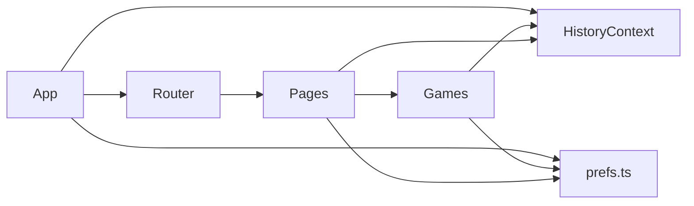

## Reaction Trainer 开发维护指南

本文档面向后续维护者，完整说明项目架构、目录、数据模型、主要功能实现、开发/调试/构建流程、扩展规范、代码风格、故障排查与常见问题。遵循本文档可快速上手迭代。

### 1. 概览
- 技术栈：React 18 + TypeScript + Vite 5 + React Router 6
- Node 要求：v18+（推荐 v20）
- 运行端口：5175（被占用会自动切换）
- 数据持久化：localStorage
  - 历史：`reaction_trainer_history_v1`
  - 偏好：`reaction_trainer_prefs_v1`
- 主要功能：
  - 反应时（Reaction Time）
  - 点靶（Aim Trainer）
  - 序列记忆（Sequence Memory）
  - Go/No-Go 抑制控制
  - Stroop 干扰
  - Tap Speed 点击速度
  - Posner 注意定向
  - 历史记录与个性化建议（Insights）
  - 设置（声效/震动/参数）

#### 快速开始
```
pnpm i
pnpm dev
# 浏览器访问 http://localhost:5175
# 生产构建
pnpm build
```

### 2. 目录结构
```
reaction-trainer/
  index.html
  package.json
  tsconfig.json
  vite.config.ts           # 配置别名 @ → src
  src/
    main.tsx              # 入口，挂载 BrowserRouter
    App.tsx               # 路由、Topbar
    styles/global.css     # 全局样式与UI Token
    contexts/
      HistoryContext.tsx  # 历史记录上下文 + 统计与建议
    pages/
      Home.tsx            # 首页卡片入口
      Insights.tsx        # 建议与历史列表
      Settings.tsx        # 偏好设置（声效/震动/参数）
    games/
      ReactionTime.tsx
      AimTrainer.tsx
      SequenceMemory.tsx
      GoNoGo.tsx
      Stroop.tsx
      TapSpeed.tsx
      PosnerCue.tsx
  docs/
    DEVELOPMENT_GUIDE.md  # 本文档
```

### 3. 路由与导航
- 在 `src/App.tsx` 中集中定义：
  - `/` 首页
  - `/reaction` 反应时
  - `/aim` 点靶
  - `/sequence` 序列记忆
  - `/gng` Go/No-Go
  - `/stroop` Stroop
  - `/taps` Tap Speed
  - `/posner` Posner Cue
  - `/insights` 建议与统计
  - `/settings` 偏好设置
  - `/planner` 训练计划
  - `/sst` Stop-Signal 抑制训练
  - `/crt` Choice Reaction 多选反应
- 顶部导航 `Topbar` 提供跳转入口并支持一键全屏。

#### 架构概览（Mermaid）


### 4. 历史记录与建议（核心）
- 文件：`src/contexts/HistoryContext.tsx`
- 模型（节选，详见源码）：
```ts
type GameKey = 'reaction' | 'aim' | 'sequence' | 'gng' | 'stroop' | 'taps' | 'posner' | 'sst' | 'crt'

interface SessionRecord {
  id: string
  game: GameKey
  dateIso: string
  reaction?: { attempts: number[]; averageMs: number; bestMs: number }
  aim?: { hits: number; accuracy: number; timeSec: number }
  sequence?: { level: number; longest: number }
  gng?: { goAcc: number; nogoAcc: number; avgRtMs: number }
  stroop?: { congruentAvgMs: number; incongruentAvgMs: number; accuracy: number; costMs: number }
  taps?: { taps: number; seconds: number; avgIntervalMs: number }
  posner?: { validAvgMs: number; invalidAvgMs: number; costMs: number; accuracy: number }
  sst?: { avgSsdMs: number; ssrtMs: number; stopSuccessPct: number; goAcc: number }
  crt?: { choices: number; avgRtMs: number; accuracy: number }
}
```
- 存储：localStorage（保留最近 1000 条）。
- API：
  - `addRecord(record)`：写入一条记录
  - `getStats()`：返回 `{ totals, last7d, recommendations }`
  - `clearAll()`：清空历史
- 建议策略：基于近 7 天的均值/阈值生成文本；可替换为分位数、EWMA 趋势或个性化模型。

修复说明（2025-08）：
- 统一训练流程未能在部分游戏结束时写入历史，已为 `Stroop`、`Go/No-Go`、`Stop-Signal` 增加 `autoMode` 与 `onFinish` 支持，并在结束时调用 `addRecord()` 与 `onFinish()`。
- `Stop-Signal` 现在在“无响应的 Stop 试次”会记录为成功停止，并按 staircase 规则增大 SSD；失败停止会减小 SSD。结束时使用 `mean(correct Go RT) - SSD` 粗略估计 SSRT。
- `Posner`/`GoNoGo`/`Stroop` 等面板确保在运行时保持焦点，避免方向键/空格事件丢失。

### 5. 各游戏实现要点
#### ReactionTime.tsx
- 相位机：`idle → wait → go → result`，随机延迟触发 `go`。
- 抢跑判定：`wait` 阶段点击计 1000ms。
- 保存：记录所有尝试数组、平均/最佳。
 - 受偏好影响：`reaction.minDelayMs/maxDelayMs`；支持声效与震动。

#### AimTrainer.tsx
- 30s 计时；目标定时生成（并发≤6）。
- 点击命中判定基于圆形半径；统计射击数、命中数与准确率。
 - 受偏好影响：目标半径、生成间隔、持续时间；命中时提示（声/震）。

#### SequenceMemory.tsx（已修复播放逻辑）
- 逐步高亮：通过 `active` 与定时器队列实现。`playSequence()` 按顺序点亮每个格子；播放结束后 `showing=false` 才允许输入。
- 定时器管理：统一存于 `timersRef`，切关/重播前先清理，防止残留定时器导致的高亮错乱。
- 最长层级：在成功晋级或失败时皆显式计算 `newLongest`，并以参数形式写入保存，避免因异步 `setState` 导致 `longest` 记录滞后。
 - 受偏好影响：点亮/间隔时间；播放时提供轻微提示音。

#### GoNoGo.tsx
- 序列共 30 次试次，Go 比例 70%。
- 按空格响应，统计 Go/No-Go 正确率与平均 RT。
- 开始时确保容器获得焦点以接收键盘事件。
 - 受偏好影响：试次数、Go 比例、ISI；正确时提示音。

#### Stroop.tsx
- 按键：D=红 F=绿 J=蓝 K=黄；依据“字体颜色”作答。
- 统计一致/不一致的平均 RT、准确率与干扰成本（incong - cong）。
- 受偏好影响：题数、不一致比例。

#### TapSpeed.tsx
- 5 秒极限点击（或空格），统计次数与平均间隔。
- 受偏好影响：计时长度。

#### PosnerCue.tsx
- 线索（←/→）后出现目标（左/右圆点），按方向键响应。
- 统计有效/无效的平均 RT、准确率与转换成本（invalid - valid）。
- 受偏好影响：试次数、有效比例、ISI。

#### StopSignal.tsx（SST）
- Go 试次（←/→）与部分 Stop 试次（延迟 SSD 后提示音）。
- 自适应 SSD（1-up/1-down）；统计 SSD、SSRT（粗略：meanGoRT-SSD）、Stop 成功率、Go 准确率。

#### ChoiceRT.tsx（CRT）
- 4选一（D/F/J/K），统计平均 RT 与准确率。

### 6. 开发与调试
- 启动：`pnpm dev`（端口 5175）。
- 生产构建：`pnpm build`。
- 别名：在 `vite.config.ts` 中配置 `@ → src`。若遇到“找不到 @ 路径”的错误，请确认已重启 dev server（配置变更需重启）。
 - 设置：参数存储在 `localStorage: reaction_trainer_prefs_v1`，页面 `Settings.tsx` 提供 UI 入口。

#### 偏好模型（`src/utils/prefs.ts`）
```ts
type Prefs = {
  soundEnabled: boolean
  vibrateEnabled: boolean
  reaction: { minDelayMs: number; maxDelayMs: number }
  aim: { radius: number; spawnMinMs: number; spawnMaxMs: number; durationSec: number }
  sequence: { showMs: number; gapMs: number }
  gng: { trials: number; goRatio: number; isiMs: number }
  stroop: { total: number; incongruentRatio: number }
  taps: { seconds: number }
  posner: { trials: number; validRatio: number; isiMs: number }
}
```
使用 `loadPrefs()/savePrefs()` 读写，或 `Settings.tsx` 直接更新。

#### 历史导入/导出与汇总
- 页面：`Insights.tsx`
- 导出 JSON/CSV；导入 JSON 后会覆盖本地历史键 `reaction_trainer_history_v1`。
 - 建议列表使用 `Sparkline` 展示反应时趋势（最近记录的平均 RT）。
 - 已补充显示 `CRT`、`SST` 的总次数统计。

### 7. 代码风格与规范
- TypeScript 严格模式。
- 命名：变量/函数见名知意，避免缩写。
- 组件：小而清晰，避免深层嵌套；使用早返回模式。
- 状态：优先使用局部状态；跨页面数据进入 Context。
 - 过渡：尽量使用 CSS transition/animation（见 `global.css`）。

### 8. 扩展指南
- 新增游戏：在 `src/games/` 下创建组件 → 在 `App.tsx` 注册路由与导航 → 在 `HistoryContext` 增加对应数据结构与统计逻辑 → 在 `Insights` 中展示指标。
- 新增指标：扩展 `SessionRecord` 对应子对象；调整 `getStats()` 的聚合/建议规则；在 `Insights.tsx` 渲染对应 UI。
- 后端同步（可选）：
  - 在 `HistoryContext` 的 `addRecord` 处加入异步上报（建议加节流/重试）。
  - 提供导入/导出（JSON/CSV）。

Checklist（新增游戏）
- [ ] 定义玩法与可调参数 → 添加到 `Prefs`
- [ ] 在 `games/` 创建组件并读入 `Prefs`
- [ ] 生成并保存 `SessionRecord`
- [ ] 在 `HistoryContext.getStats()` 增加建议逻辑（可选）
- [ ] 在 `App.tsx` 路由/导航与 `Home.tsx` 卡片接入
- [ ] 在 `Insights.tsx` 渲染历史指标

### 9. 常见问题与排查
- Vite 别名报错：重启 dev server；确认 `vite.config.ts` 中 `resolve.alias` 配置与 `tsconfig.json` 路径一致。
- HMR Fast Refresh 提示 Hook 不兼容：某些导出结构变化导致，触发全量刷新或重启可恢复。
- 键盘事件不生效：确保可聚焦容器设置了 `tabIndex={0}`，并在开始时调用 `ref.current?.focus()`。
- 序列记忆高亮乱序：确认 `playSequence()` 每次开头清理定时器；避免叠加。
 - `replaceAll` 编译错误：目标 lib 使用 ES2020；请将字符串替换为 `str.replace(/pattern/g, ...)`。
 - 端口占用：日志提示后自动切换到 5176 等端口。
 - 音频不响：移动端需用户手势激活 AudioContext；先进行一次点击。
 - 震动无效：桌面浏览器可能不支持 `navigator.vibrate`。

### 10. 发布与版本
- 本项目为纯前端，可直接将 `dist/` 部署至静态托管（如 Netlify、Vercel、Nginx）。
- 版本管理建议遵循 semver；在 README 中维护变更记录或使用 CHANGELOG。
 - 若部署在子路径，需在 `vite.config.ts` 配置 `base` 或使用反向代理。

### 11. 未来优化方向
- 更精细的难度自适应（基于个人历史分位数实时调整参数）。
- 更丰富的建议（趋势图表、对比同龄/总体分布）。
- 训练计划：每日/每周目标与提醒。
- 移动端触控优化与可访问性（A11y）。
 - 单元测试与端到端测试：可引入 Vitest/Cypress；为核心逻辑（计时、判定）编写测试。
 - 国际化（i18n）：抽离文本，接入 i18n 库（如 react-i18next）。


