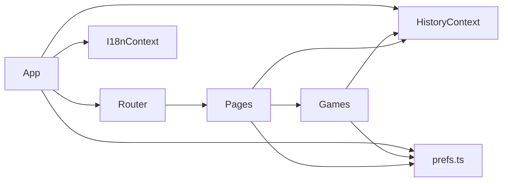

## Reaction Trainer — Development Guide

This document describes architecture, directories, data models, major features, dev/debug/build flows, extension guidelines, code style, troubleshooting and FAQs.

### 1. Overview
- Stack: React 18 + TypeScript + Vite 5 + React Router 6
- Node: v18+ (recommend v20)
- Dev port: 5175 (auto fallback)
- Persistence: localStorage
  - History: `reaction_trainer_history_v1`
  - Preferences: `reaction_trainer_prefs_v1`
- Modules: Reaction Time, Aim Trainer, Sequence Memory, Go/No-Go, Stroop, Tap Speed, Posner Cue, Stop-Signal (SST), Choice Reaction (CRT), Insights, Settings

#### Quick Start
```
pnpm i
pnpm dev
# http://localhost:5175
# Production build
pnpm build
```

### 2. Directory Structure
```
reaction-trainer/
  index.html
  package.json
  tsconfig.json
  vite.config.ts           # alias @ → src
  src/
    main.tsx              # entry
    App.tsx               # routes, Topbar
    styles/global.css     # global styles & tokens
    contexts/
      HistoryContext.tsx  # history + stats + tips
      I18nContext.tsx     # language switcher (en/zh/es/ar/ru)
    pages/
      Home.tsx            # landing cards
      Insights.tsx        # insights + history
      Settings.tsx        # preferences (sound/vibration/params)
    games/
      ReactionTime.tsx
      AimTrainer.tsx
      SequenceMemory.tsx
      GoNoGo.tsx
      Stroop.tsx
      TapSpeed.tsx
      PosnerCue.tsx
        StopSignal.tsx
        ChoiceRT.tsx
  docs/
    DEVELOPMENT_GUIDE.md
```

### 3. Routing & Navigation
- Declared in `src/App.tsx` for all pages and games.
- Topbar contains language switcher and fullscreen.

#### Architecture (Mermaid)


### 4. History & Insights (Core)
- File: `src/contexts/HistoryContext.tsx`
- Model (excerpt):
```ts
type GameKey = 'reaction' | 'aim' | 'sequence' | 'gng' | 'stroop' | 'taps' | 'posner' | 'sst' | 'crt'

interface SessionRecord {
  id: string
  game: GameKey
  dateIso: string
  reaction?: { attempts: number[]; averageMs: number; bestMs: number }
  aim?: { hits: number; accuracy: number; timeSec: number }
  sequence?: { level: number; longest: number }
  gng?: { goAcc: number; nogoAcc: number; avgRtMs: number }
  stroop?: { congruentAvgMs: number; incongruentAvgMs: number; accuracy: number; costMs: number }
  taps?: { taps: number; seconds: number; avgIntervalMs: number }
  posner?: { validAvgMs: number; invalidAvgMs: number; costMs: number; accuracy: number }
  sst?: { avgSsdMs: number; ssrtMs: number; stopSuccessPct: number; goAcc: number }
  crt?: { choices: number; avgRtMs: number; accuracy: number }
}
```
- Storage: localStorage (last 1000 kept)
- API: `addRecord(record)`, `getStats()`, `clearAll()`
- Recommendations: 7d average thresholds; can be replaced with quantiles/EWMA/persona.

Fix Log (2025-08):
- Auto-flow saving fixed for Stroop, Go/No-Go, Stop-Signal via `autoMode` + `onFinish`.
- Stop-Signal records successful stops on non-response, SSD staircase adjusts, SSRT ≈ mean(correct Go RT) − SSD.
- Panels keep focus to avoid lost key events.

### 5. Implementation Notes by Game
- ReactionTime.tsx: phases `idle → wait → go → result`; early click in WAIT counts as 1000ms; saves attempts/avg/best; prefs: min/max delay; sound/vibration supported.
- AimTrainer.tsx: 30s timer; spawn targets (≤6 concurrent); circle hit-test; metrics: hits/accuracy/time; prefs: radius/spawn/duration; hit feedback.
- SequenceMemory.tsx: sequential highlight using timers; timers cleaned; longest tracked explicitly to avoid async state lag; prefs: show/gap.
- GoNoGo.tsx: 30 trials, GO ratio 70%; Space to respond; focus ensured; prefs: trials/ratio/ISI.
- Stroop.tsx: D/F/J/K mapped to Red/Green/Blue/Yellow; metrics include congruent/incongruent averages and cost; prefs: total, incongruent ratio.
- TapSpeed.tsx: 5s tapping (or Space); track taps and avg interval; prefs: seconds.
- PosnerCue.tsx: left/right cue then target; Arrow keys to respond; metrics include valid/invalid averages and cost; prefs: trials/valid ratio/ISI.
- StopSignal.tsx (SST): GO trials (←/→) with occasional Stop after SSD (beep); 1-up/1-down on SSD; metrics include avg SSD, SSRT, stop success, GO accuracy.
- ChoiceRT.tsx (CRT): 4-choice (D/F/J/K); tracks avg RT and accuracy.

### 6. Development & Debug
- Start: `pnpm dev` (port 5175)
- Build: `pnpm build`
- Alias: `@ → src` configured in `vite.config.ts`; restart dev server after changes.
- Preferences: stored in `localStorage: reaction_trainer_prefs_v1`; UI in `Settings.tsx`.

#### Preferences (`src/utils/prefs.ts`)
```ts
type Prefs = {
  soundEnabled: boolean
  vibrateEnabled: boolean
  reaction: { minDelayMs: number; maxDelayMs: number }
  aim: { radius: number; spawnMinMs: number; spawnMaxMs: number; durationSec: number }
  sequence: { showMs: number; gapMs: number }
  gng: { trials: number; goRatio: number; isiMs: number }
  stroop: { total: number; incongruentRatio: number }
  taps: { seconds: number }
  posner: { trials: number; validRatio: number; isiMs: number }
}
```
Use `loadPrefs()/savePrefs()` or change via `Settings.tsx`.

#### Insights & Summary
- Page: `Insights.tsx`
- Export JSON/CSV; Import replaces local `reaction_trainer_history_v1`.
- Sparkline shows recent avg RT; totals include CRT/SST.

### 7. Code Style
- Strict TS, clear naming, early returns, handle edge cases first.
- Prefer local state; cross-page data via Context.
- Prefer CSS transitions/animations (see `global.css`).

### 8. Extension Guidelines
- Add a new game under `src/games/` → register in `App.tsx` → extend History model and Insights if needed.
- Add new metrics by extending `SessionRecord` and `getStats()` aggregation.
- Optional backend sync: throttle/retry around `addRecord`.

Checklist (New Game)
- [ ] Define mechanics and parameters → add to `Prefs`
- [ ] Implement component under `games/` and read `Prefs`
- [ ] Create `SessionRecord` and save
- [ ] Extend `getStats()` recommendations (optional)
- [ ] Register routes/cards
- [ ] Render metrics in `Insights.tsx`

### 9. Troubleshooting
- Vite alias errors: restart dev server; ensure `vite.config.ts` resolves alias.
- HMR refresh warnings: full reload or restart.
- Keyboard not working: ensure focusable container (`tabIndex={0}`) and call `.focus()` on start.
- Sequence highlights off-order: clear timers at play start; avoid stacking timeouts.
- Ports busy: Vite will switch to 5176, etc.
- Mobile audio requires user gesture; vibration not supported on some desktops.

### 10. Release & Versioning
- Pure frontend; deploy `dist/` to static hosting (Netlify/Vercel/Nginx).
- Follow semver; maintain CHANGELOG or add release notes in README.
- For sub-path deploys, configure `base` in `vite.config.ts` or use a reverse proxy.

### 11. Roadmap Suggestions
- Finer difficulty adaptation (personal quantiles).
- Richer insights (trend charts, cohort comparisons).
- Training planner with goals and reminders.
- Mobile touch and accessibility improvements (A11y).
- Tests (Vitest/Cypress) for core timing/logic.
- Consider externalizing i18n to libraries (e.g., react-i18next).


